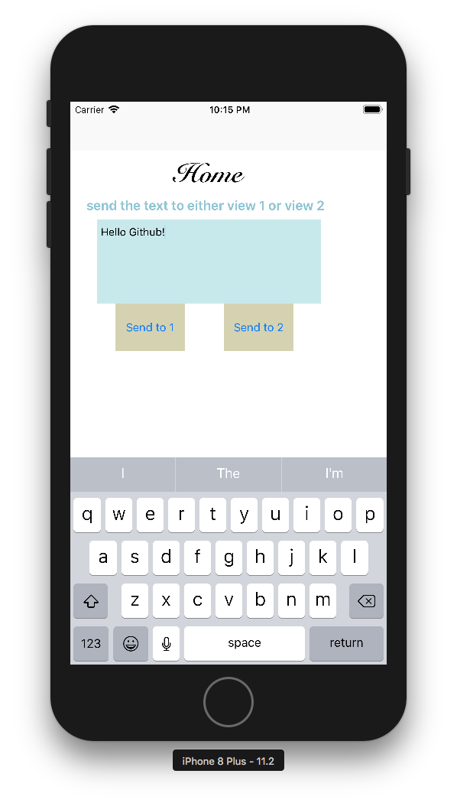
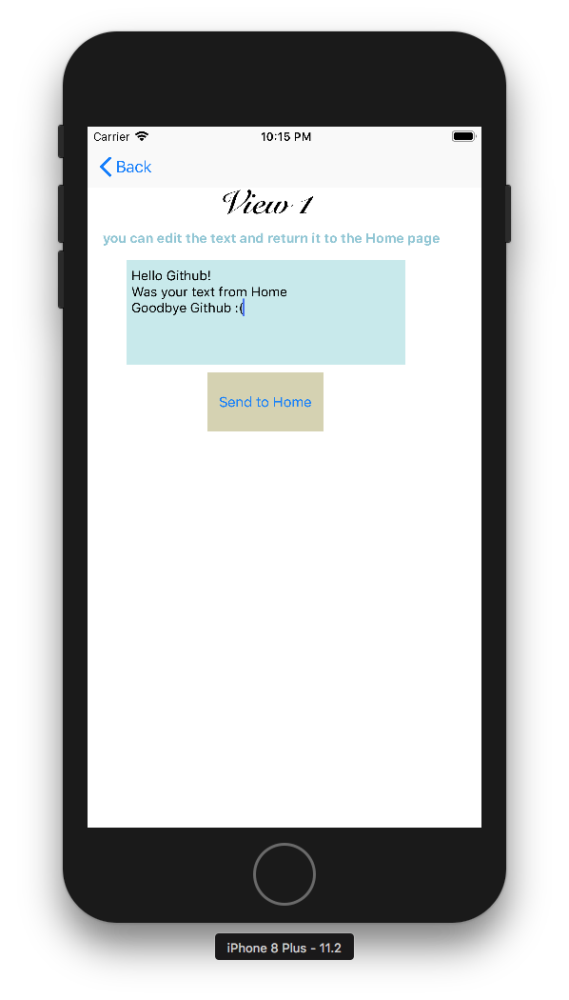
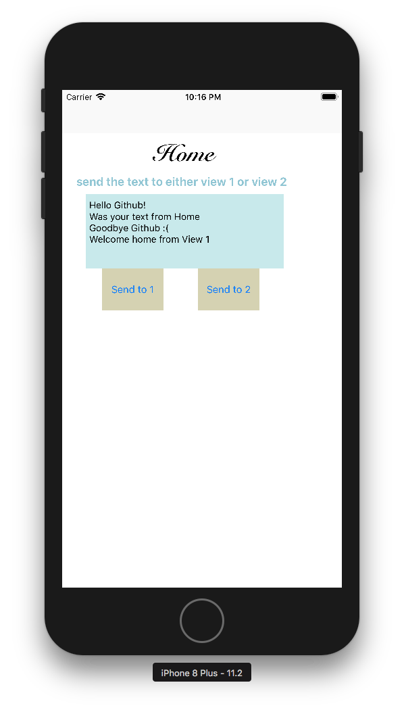

#  Storyboard-App
A toy app to demonstrate sending variables back and forth between iOS views  

entered some text then pressed "Send to 1"

the text appeared in the new view along with a short message. After editing again, pressed "Send to Home"

